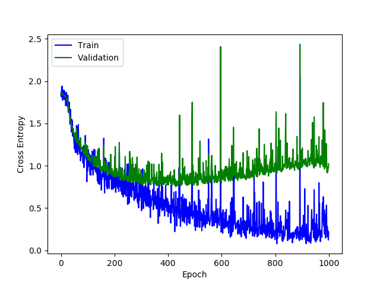

## Classification
* how to run
```
python nn.py
```
* result
```
Epoch 999 Step 27 Train CE 0.19935 Train Acc 0.94000
Epoch 999 Step 28 Train CE 0.11606 Train Acc 0.97000
Epoch 999 Step 29 Train CE 0.24567 Train Acc 0.91000
Epoch 999 Step 30 Train CE 0.12061 Train Acc 0.97000
Epoch 999 Step 31 Train CE 0.14903 Train Acc 0.94000
Epoch 999 Step 32 Train CE 0.16059 Train Acc 0.95000
Epoch 999 Step 33 Train CE 0.15045 Train Acc 0.94595
Epoch 999 Validation CE 0.96540 Validation Acc 0.73747


CE: Train 0.26958 Validation 0.96540 Test 0.80507
Acc: Train 0.90427 Validation 0.73747 Test 0.77662

```
* Accuracy


* Loss



